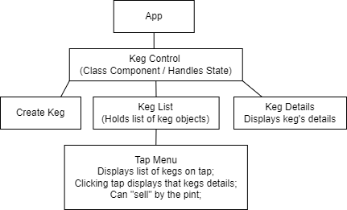

  <u><big>|| <b>Tap Room</b> ||</big></u>
   
  <em>Epicodus - React - React Fundamentals - Code Review</em>
   
   
  <strong>Jessi B</strong>
   
  <small>April 2022</small>
   
  ___________________________
   

  

  

------------------------------

### <u>Table of Contents</u>
* <a href="#-description">Description</a>
* <a href="#-technologies-used">Technologies Used</a>
* <a href="#-setup-&-installation">Setup & Installation</a>
* <a href="#-known-bugs">Known Bugs</a>
* <a href="#-contact">Contact</a>
* <a href="#-license">License</a>

------------------------------

### Description
This React app allows a user to track kegs.

As a user, I want to see a list/menu of all available kegs. For each keg, I want to see its name, brand, price and alcoholContent (or perhaps something like flavor for a kombucha store).
As a user, I want to submit a form to add a new keg to a list.
As a user, I want to be able to click on a keg to see its detail page.
As a user, I want to see how many pints are left in a keg. Hint: A full keg has roughly 124 pints.
As a user, I want to be able to click a button next to a keg whenever I sell a pint of it. This should decrease the number of pints left by 1. Pints should not be able to go below 0.
#
### Technologies Used
* [Visual Studio Code](https://code.visualstudio.com/)
* [React](https://reactjs.org/docs/getting-started.html)
* Javascript
* JSX
* HTML
#
### Setup & Installation
* Clone Repo: In your terminal, navigate to your desktop or other desired location and enter `git clone https://github.com/jessi-b/tap-room.git`
* Add Required Packages: Navigate to the top level of the project directory called _tap-room_ & enter each of the 
* Try Out This Web App: Enter `npm start` in the command line and navigte to _http://localhost:3000/_ in your browser
#
### Known Bugs
Sell pint functionality does not work.
#
### License
Copyright (c)  _Apr 2022_  _Jessi B_
#
### Contact
_If you run into any issues or have questions, ideas or concerns or wish to make a contribution to the code see contact information below._
* Jessi B  <em><jessb.dev@gmail.com></em>
------------------------------

<a href="#">Return to Top</a>

## Available Scripts

In the project directory, you can run:

### `npm start`

Runs the app in the development mode.\
Open [http://localhost:3000](http://localhost:3000) to view it in your browser.

The page will reload when you make changes.\
You may also see any lint errors in the console.

### `npm test`

Launches the test runner in the interactive watch mode.\
See the section about [running tests](https://facebook.github.io/create-react-app/docs/running-tests) for more information.

### `npm run build`

Builds the app for production to the `build` folder.\
It correctly bundles React in production mode and optimizes the build for the best performance.

The build is minified and the filenames include the hashes.\
Your app is ready to be deployed!

See the section about [deployment](https://facebook.github.io/create-react-app/docs/deployment) for more information.

### `npm run eject`

**Note: this is a one-way operation. Once you `eject`, you can't go back!**

If you aren't satisfied with the build tool and configuration choices, you can `eject` at any time. This command will remove the single build dependency from your project.

Instead, it will copy all the configuration files and the transitive dependencies (webpack, Babel, ESLint, etc) right into your project so you have full control over them. All of the commands except `eject` will still work, but they will point to the copied scripts so you can tweak them. At this point you're on your own.

You don't have to ever use `eject`. The curated feature set is suitable for small and middle deployments, and you shouldn't feel obligated to use this feature. However we understand that this tool wouldn't be useful if you couldn't customize it when you are ready for it.

## Learn More

You can learn more in the [Create React App documentation](https://facebook.github.io/create-react-app/docs/getting-started).

To learn React, check out the [React documentation](https://reactjs.org/).

### Code Splitting

This section has moved here: [https://facebook.github.io/create-react-app/docs/code-splitting](https://facebook.github.io/create-react-app/docs/code-splitting)

### Analyzing the Bundle Size

This section has moved here: [https://facebook.github.io/create-react-app/docs/analyzing-the-bundle-size](https://facebook.github.io/create-react-app/docs/analyzing-the-bundle-size)

### Making a Progressive Web App

This section has moved here: [https://facebook.github.io/create-react-app/docs/making-a-progressive-web-app](https://facebook.github.io/create-react-app/docs/making-a-progressive-web-app)

### Advanced Configuration

This section has moved here: [https://facebook.github.io/create-react-app/docs/advanced-configuration](https://facebook.github.io/create-react-app/docs/advanced-configuration)

### Deployment

This section has moved here: [https://facebook.github.io/create-react-app/docs/deployment](https://facebook.github.io/create-react-app/docs/deployment)

### `npm run build` fails to minify

This section has moved here: [https://facebook.github.io/create-react-app/docs/troubleshooting#npm-run-build-fails-to-minify](https://facebook.github.io/create-react-app/docs/troubleshooting#npm-run-build-fails-to-minify)

<a href="#">Return to Top</a>
